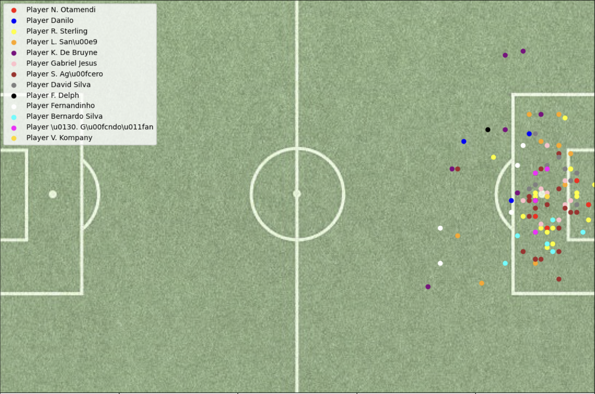
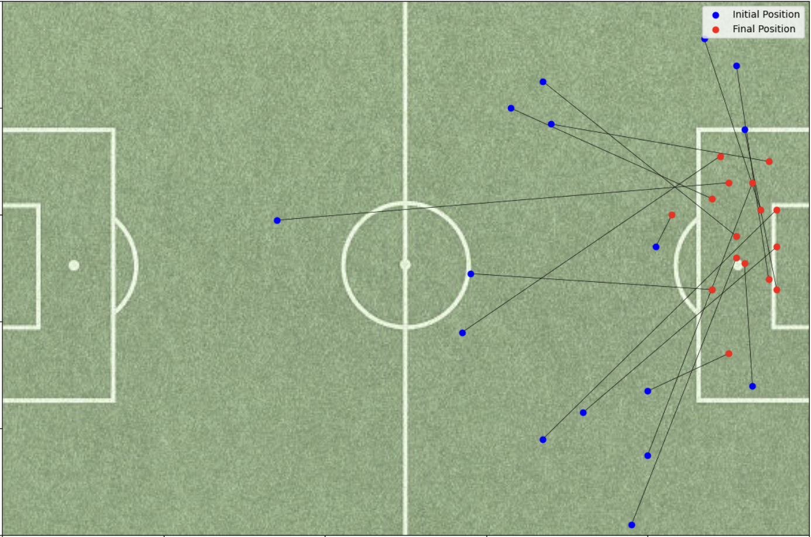
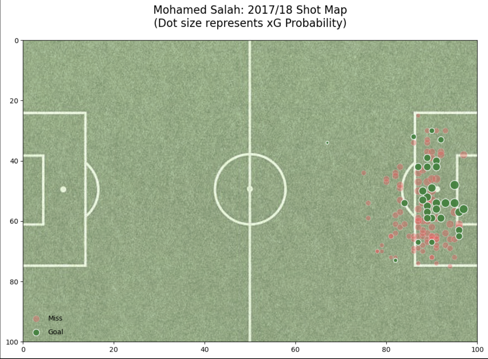
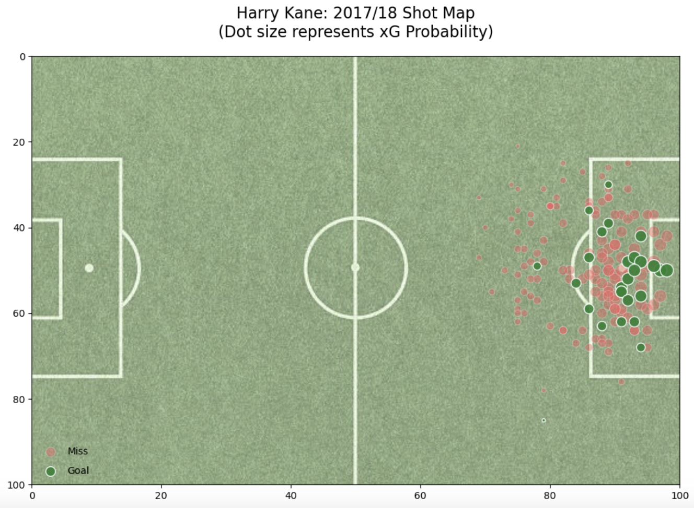
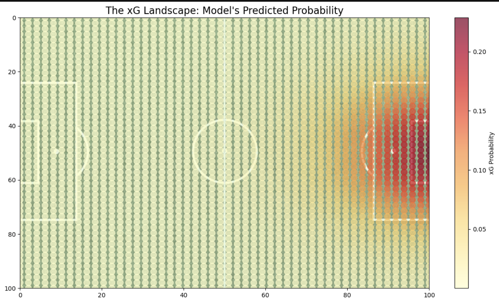

# Premier League Football Analysis (2017-18)
Data analysis and visualization of the 2017-18 Premier League season, featuring expected goals (xG) modeling, shot analysis, player performance metrics, and team visualizations.

## Features

### 1. Expected Goals (xG) Model
- Logistic regression model predicting goal probability from shot characteristics (distance, angle)
- Handles class imbalance through weighted training and model calibration
- Player-level xG aggregation identifying clinical finishers vs underperformers
- Shot conversion rate analysis

### 2. Shot & Goal Analysis
- Shot location heatmaps showing where teams attempt shots
- Goal position visualization revealing scoring patterns
- Shot-to-goal conversion metrics by player and team

### 3. Assist Paths
- Assist path analysis showing player connections


## Dataset

Uses the **Soccer Match Event Dataset** (2017-18 Premier League) from Figshare containing detailed match events, player actions, and positional data.

See `data/DATA_SOURCE.md` for download instructions.

## Installation
```bash
git clone https://github.com/yourusername/football-analysis.git
cd football-analysis
pip install -r requirements.txt
```

## Usage

1. **Download dataset** - Follow instructions in `data/DATA_SOURCE.md` and place data one level above this repo
2. **Process data** - Run `notebooks/data_processing.ipynb` to create database from raw JSON files
3. **Run analysis:**
   - `notebooks/xG_analysis.ipynb` - Expected Goals modeling and player analysis
   - `notebooks/goals_and_assists.ipynb` - Team and player performance visualization

## Visualizations

### Goal Positions of a Team (Man City 2017-18 PL)


### Assist Paths of a Player (Kevin De Bruyne 2017-18 PL)


### Salah Shots vs Goals


### Kane Shots vs Goals


### xG Landscape


## Key Insights

- Top assisting players like Kevin De Bruyne show extraordinary assist path patterns with creative ball progression
- Salah, Kane, and Vardy overperformed their xG significantly, demonstrating clinical finishing in the 2017-18 season
- xG model correctly reflects shot quality based on distance and angle to goal


## Technical Stack

**Python** | **Pandas** | **NumPy** | **Scikit-learn** | **Matplotlib** | **SQLite**

## Project Structure
```
├── data/                  # Processed data and database
├── src/                   # Helper modules
│   ├── queries.py         # Database queries
│   └── plots.py           # Visualization functions
├── notebooks/             # Analysis notebooks
│   ├── data_processing.ipynb
│   ├── xG_analysis.ipynb
│   └── goals_and_assists.ipynb
├── outputs/plots/         # Generated visualizations
└── assets/                # Static resources
```

## Future Work

- Multi-season comparison analysis
- Interactive dashboard with Plotly
- Advanced passing network analysis
